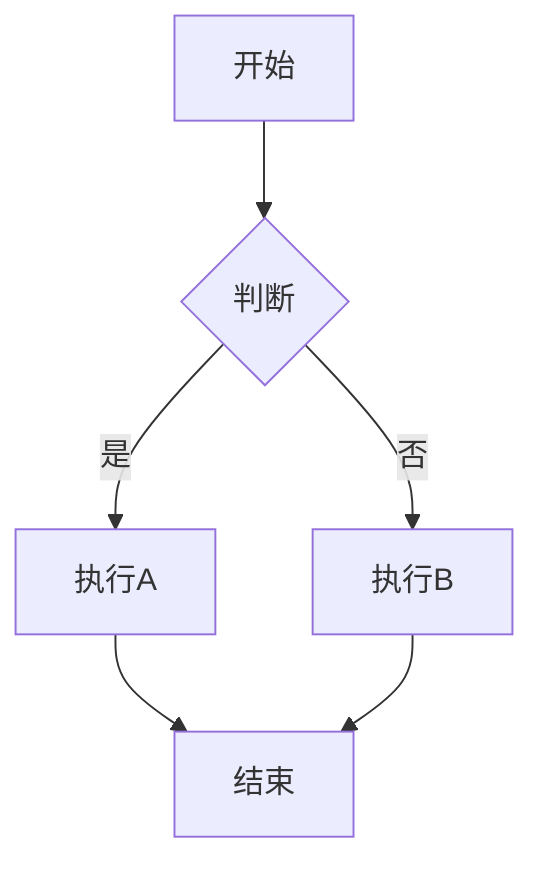

# Chirpy 功能速查手册

Chirpy 主题提供了丰富的 Markdown 扩展功能。本文档是快速参考，用于查阅各种功能的语法和用法。

有关这些功能在写作中的使用规范，请参阅 `docs/rules/articles.md`。

---

## 图片

### 基本语法

```markdown
{: w="宽度" h="高度" }
```

### 尺寸

用 `w` 和 `h` 属性指定宽高（像素），防止页面加载时布局抖动：

```markdown
{: w="700" h="400" }
```

### 位置

默认居中。可以通过 class 调整位置：

| Class | 效果 |
|-------|------|
| `.normal` | 左对齐（不居中） |
| `.left` | 左浮动，文字环绕 |
| `.right` | 右浮动，文字环绕 |

```markdown
{: .left w="350" h="250" }
```

> **注意：** 指定位置后，不应再添加图片标题。

### 图片标题

在图片下一行写斜体文字：

```markdown

*这是图片标题*
```

### 阴影

给截图添加阴影效果：

```markdown
{: .shadow }
```

### 暗色/亮色模式图片

准备两张图片分别用于暗色和亮色主题，用不同 class 区分：

```markdown
{: .light }
{: .dark }
```

### 文章封面图（Preview Image）

在 Front Matter 中设置，用于首页卡片和 SEO `og:image`。推荐分辨率 `1200 x 630`（比例 1.91:1）：

```yaml
image:
  path: /path/to/cover.png
  alt: 封面图片描述
```

也可以简写为：

```yaml
image: /path/to/cover.png
```

### LQIP（低质量图片占位符）

为图片提供低质量占位符，在图片加载完成前显示模糊预览：

```yaml
# 用于封面图
image:
  path: /path/to/cover.png
  lqip: /path/to/lqip.webp   # 或 base64 URI
```

用于正文中的图片：

```markdown
{: lqip="/path/to/lqip.webp" }
```

### 路径前缀

可以用 `media_subpath` 和 `cdn` 简化图片路径。

**文章级**（Front Matter）：

```yaml
media_subpath: /assets/images/my-post/
```

正文中只需写文件名：

```markdown

```

**全局 CDN**（`_config.yml`）：

```yaml
cdn: https://cdn.example.com
```

最终图片 URL 为：`[cdn][media_subpath]文件名`

---

## 提示块（Prompts）

四种类型，用 blockquote + class 实现：

```markdown
> 小技巧或最佳实践
{: .prompt-tip }

> 补充信息或背景知识
{: .prompt-info }

> 需要注意的限制或坑
{: .prompt-warning }

> 可能导致严重后果的操作
{: .prompt-danger }
```

---

## 代码块

### 语法高亮

````markdown
```语言
代码内容
```
````

常用语言：`yaml`、`shell`、`python`、`ruby`、`javascript`、`json`、`markdown`、`html`、`css`、`dockerfile`。

### 文件名

在代码块下方添加 `{: file="路径" }`，代码块顶部会显示文件名替代语言名：

````markdown
```yaml
key: value
```
{: file="_config.yml" }
````

### 隐藏行号

默认会显示行号（`plaintext`、`console`、`terminal` 除外）。要隐藏行号：

````markdown
```shell
echo '没有行号'
```
{: .nolineno }
````

### Liquid 代码

如果代码块中包含 Liquid 模板语法（`{%` `{{`），需要用 `raw` 包裹：

````markdown

```liquid

  This product's title contains the word Pack.

```

````

或者在文章 Front Matter 中添加 `render_with_liquid: false`。

### 文件路径高亮

在正文中高亮文件路径：

```markdown
`/path/to/file.ext`{: .filepath}
```

---

## 数学公式（MathJax）

在 Front Matter 中启用：

```yaml
math: true
```

**块级公式**（前后必须有空行）：

```markdown

$$
数学表达式
$$

```

**公式编号与引用**：

```markdown

$$
\begin{equation}
  \sum_{n=1}^\infty 1/n^2 = \frac{\pi^2}{6}
  \label{eq:series}
\end{equation}
$$

引用公式 \eqref{eq:series}。
```

**行内公式**（与文字在同一行，`$$` 前后不要有空行）：

```markdown
当 $$ a \ne 0 $$ 时，方程 $$ ax^2 + bx + c = 0 $$ 有两个解。
```

**列表中的行内公式**（转义第一个 `$`）：

```markdown
1. \$$ E = mc^2 $$
2. \$$ F = ma $$
```

> **说明：** 从 v7.0.0 起，MathJax 配置在 `assets/js/data/mathjax.js`。如果你使用 chirpy-starter，需要从 gem 安装目录复制该文件到你的仓库。

---

## Mermaid 图表

在 Front Matter 中启用：

```yaml
mermaid: true
```

支持的图表类型：流程图（`graph`）、时序图（`sequenceDiagram`）、甘特图（`gantt`）、类图（`classDiagram`）、状态图（`stateDiagram`）、饼图（`pie`）等。

示例 — 流程图：

````markdown

````

---

## 媒体嵌入

### YouTube

```liquid

```

### Bilibili

```liquid

```

### Twitch

```liquid

```

### Spotify

```liquid

```

额外参数：

- `compact=1` — 紧凑播放器
- `dark=1` — 强制暗色主题

### 视频文件

```liquid

```

可选属性：

| 属性 | 说明 |
|------|------|
| `poster='图片URL'` | 视频封面图 |
| `title='标题'` | 视频标题（显示在下方） |
| `autoplay=true` | 自动播放 |
| `loop=true` | 循环播放 |
| `muted=true` | 静音 |
| `types='ogg\|mov'` | 额外视频格式 |

### 音频文件

```liquid

```

可选属性：`title='标题'`、`types='ogg|wav'`。

---

## 其他功能

### 置顶文章

```yaml
pin: true
```

按发布日期倒序排列在首页顶部。

### 作者信息

默认使用 `_config.yml` 中的 `social.name`。也可以创建 `_data/authors.yml` 来自定义：

```yaml
# _data/authors.yml
boming:
  name: Boming Huang
  twitter: huangboming
  url: https://github.com/huangboming
```

然后在文章 Front Matter 中引用：

```yaml
author: boming
```
