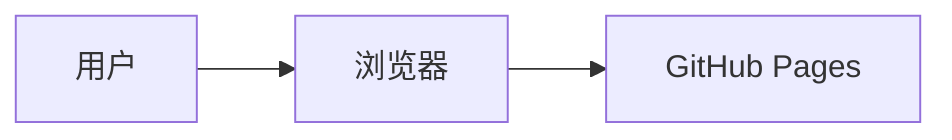

# 文章规则

## 目录

存放位置 + 命名规范：`_posts/<文章发布日期>-<文章英文 slug>.md`。

示例：`_posts/2025-06-27-cursor-vibe-coding.md`

## 元数据（Front Matter）

每篇文章开头必须包含以下 YAML 头：

```yaml
---
layout: post
title: <文章标题>
date: <文章发布日期>
categories: <分类>
tags: [<标签1>, <标签2>, <标签3>]
description: <文章摘要>
---
```

### `title`

文章标题。简洁明了，让读者一眼就知道文章主题。

### `date`

发布日期，格式 `YYYY-MM-DD`。应与文件名中的日期一致。

### `categories`

**一个文章只能有一个分类**。分类用中文。

决定文章分类时，先在已有分类中寻找。如果现有分类都不合适，可以考虑新增分类。

已有分类：
- 技术
- 旅游
- 学习与研究

### `tags`

标签用中文，最好 **一到三个**，用 YAML 列表格式书写：`tags: [AI, 自建服务]`。

决定文章标签时，先在已有标签中寻找。如果现有标签都不合适，可以考虑新增标签。

已有标签：
- AI
- 自建服务
- 开发环境
- DevOps
- 香港
- 阅读

### `description`（推荐）

文章摘要，用于：
- 首页文章列表的摘要文字
- SEO 的 `meta description`
- RSS 订阅的摘要内容

如果不写 `description`，首页会自动截取文章开头前几句话作为摘要，效果不可控。**建议每篇文章都写**，长度控制在 1-2 句话。

示例：
```yaml
description: 分享使用 Cursor Agent 进行 vibe coding 的心得，以及如何通过任务拆解和上下文管理提升 AI 编码效率。
```

### `pin`（可选）

将文章置顶到首页，适合非常重要的文章或系列导读。

```yaml
pin: true
```

### `toc`（可选）

控制单篇文章是否显示目录（Table of Contents）。全局默认为 `true`，如果某篇文章不需要目录，可以关闭：

```yaml
toc: false
```

### `comments`（可选）

控制单篇文章是否开启评论。全局默认开启，如果某篇文章不需要评论区：

```yaml
comments: false
```

## 图片

### 存放位置

```
assets/images/<文章 slug>/<图片序号>.<扩展名>
```

示例：`assets/images/deploy-openwebui/1.png`

### 引用图片

**推荐使用 `media_subpath`** 简化图片引用。在 Front Matter 中设置：

```yaml
media_subpath: /assets/images/<文章 slug>/
```

之后在正文中只需写文件名：

```markdown

```

### 图片尺寸

图片应标注宽高，防止页面加载时布局抖动：

```markdown
{: w="700" h="400" }
```

### 图片标题

在图片下一行写斜体文字，会自动渲染为图片标题：

```markdown
{: w="700" h="400" }
*这里是图片标题*
```

### 截图阴影

截图类图片建议加阴影效果：

```markdown
{: .shadow }
```

### 图片格式

目前允许原图（PNG/JPG），后续可以考虑压缩或转 WebP。

## 正文排版

### 提示块（Prompts）

Chirpy 支持四种提示块，用 blockquote + class 实现：

```markdown
> 温馨提示内容
{: .prompt-tip }

> 补充信息
{: .prompt-info }

> 注意事项
{: .prompt-warning }

> 危险警告
{: .prompt-danger }
```

**使用建议**：
- `.prompt-tip` — 小技巧、最佳实践
- `.prompt-info` — 补充说明、背景知识
- `.prompt-warning` — 需要注意的坑、限制
- `.prompt-danger` — 可能导致严重后果的操作

### 代码块

格式：```` ```语言 ````

语言标记常用：`yaml`、`shell`、`python`、`markdown`、`json`。

可以附带文件名：

````markdown
```yaml
key: value
```
{: file="_config.yml" }
````

### 交叉引用

引用站内其他文章使用 Jekyll 的 `post_url` 标签：

```liquid
[文章标题]()
```

### 脚注

```markdown
这是一段文字[^1]。

[^1]: 这是脚注内容。
```

### Mermaid 图表（可选）

如果需要画流程图、时序图、架构图，可以使用 Mermaid。先在 Front Matter 中启用：

```yaml
mermaid: true
```

然后在正文中：

````markdown

````

## 文章质量要求

- 文章内容应逻辑清晰、文字通顺
- 技术文章应提供可复现的步骤
- 涉及外部服务/工具时，附上官方文档链接
- 代码块应标注语言，方便语法高亮
- 截图应有标题说明
